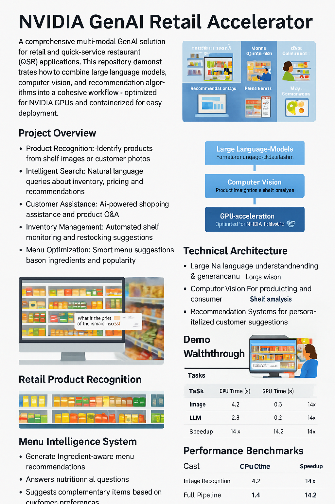
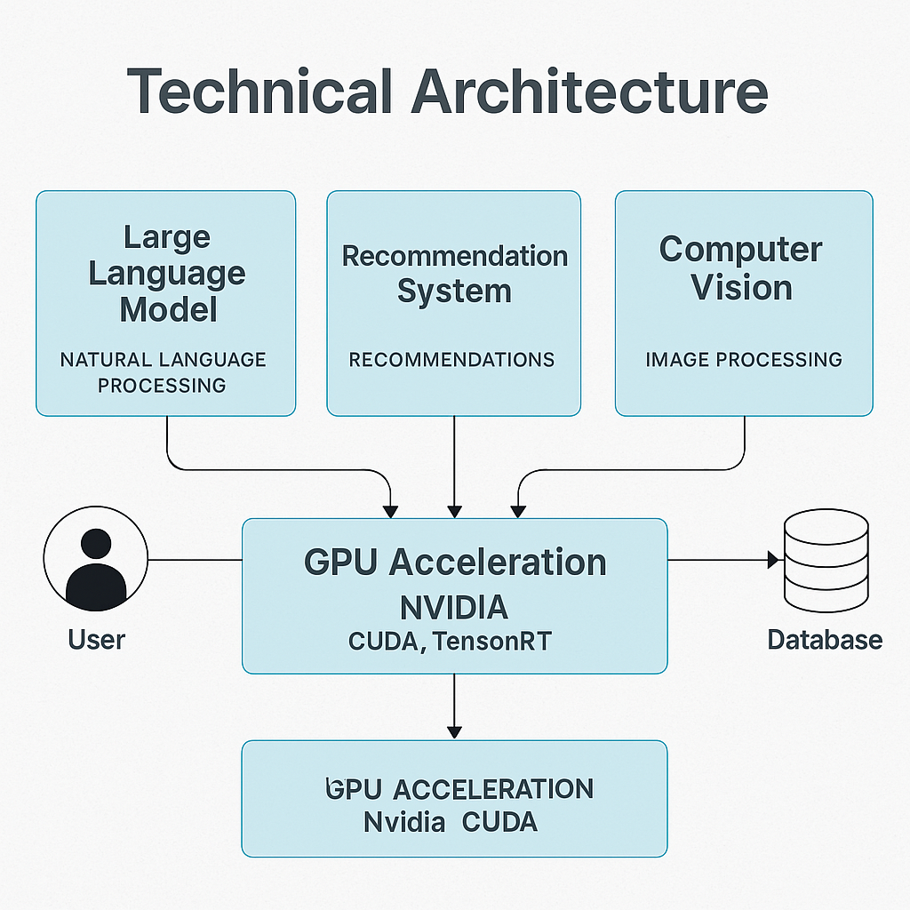
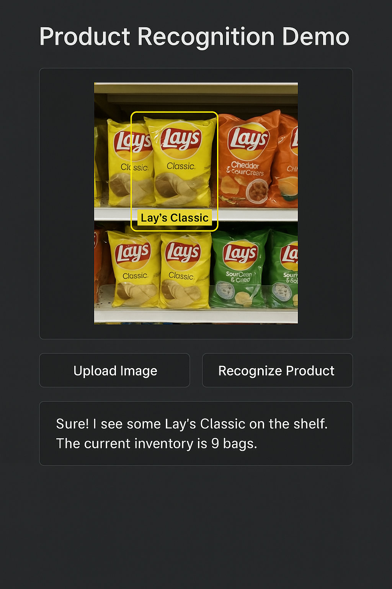

# NVIDIA GenAI Retail Accelerator

A comprehensive multi-modal GenAI solution for retail and quick-service restaurant (QSR) applications. This repository demonstrates how to combine large language models, computer vision, and recommendation algorithms into a cohesive workflow—optimized for NVIDIA GPUs and containerized for easy deployment.



## Project Overview

This accelerator tackles common retail and QSR challenges through AI-powered solutions:

- **Product Recognition**: Identify products from shelf images or customer photos
- **Intelligent Search**: Natural language queries about inventory, pricing, and recommendations
- **Customer Assistance**: AI-powered shopping assistance and product Q&A
- **Inventory Management**: Automated shelf monitoring and restocking suggestions
- **Menu Optimization**: Smart menu suggestions based on ingredients and popularity

## Technical Architecture

This project integrates multiple AI modalities to create a comprehensive retail solution:

- **Large Language Models**: For natural language understanding and generation
- **Computer Vision**: For product recognition and shelf analysis
- **Recommendation Systems**: For personalized customer suggestions
- **GPU Acceleration**: Optimized for NVIDIA hardware with CUDA/TensorRT



## Repository Structure

```
/notebooks             # Jupyter notebooks demonstrating key workflows
  ├─ 01_data_preparation.ipynb           # Data gathering and preprocessing
  ├─ 02_model_building_multimodal.ipynb  # Combined text and image model training
  ├─ 03_inference_pipeline_demo.ipynb    # End-to-end inference pipeline
  └─ 04_deployment_container.ipynb       # Containerization instructions

/src                   # Source code and utilities
  ├─ models/           # Model definitions and training utilities
  ├─ data/             # Data processing and management
  ├─ inference/        # Inference pipeline components
  └─ utils/            # Helper functions and utilities

/docker                # Docker configuration
  ├─ Dockerfile        # Container definition
  └─ docker-compose.yml # Multi-container setup

/docs                  # Extended documentation
  ├─ architecture.md   # Detailed system architecture
  ├─ performance.md    # Performance benchmarks
  └─ images/           # Documentation images

/examples              # Example data and demonstration assets
  ├─ images/           # Sample retail images
  ├─ product_data/     # Product catalog information
  └─ demo_app/         # Simple demo application
```

## Getting Started

### Prerequisites

- NVIDIA GPU (recommended)
- CUDA Toolkit 12.0+
- Docker with NVIDIA Container Toolkit
- Python 3.10+

### Installation

1. Clone this repository:
   ```bash
   git clone https://github.com/awaliuddin/nvidia-genai-retail-accelerator.git
   cd nvidia-genai-retail-accelerator
   ```

2. Set up the environment:
   ```bash
   # Option 1: Using conda
   conda env create -f environment.yml
   conda activate retail-genai

   # Option 2: Using Docker
   docker-compose up -d
   ```

3. Download the example data:
   ```bash
   python src/utils/download_demo_data.py
   ```

## Demo Walkthroughs

### Retail Product Recognition



Upload an image of a store shelf or product to identify items, check inventory, and answer natural language queries about the products.

### Menu Intelligence System

Our QSR menu intelligence system can:
- Generate ingredient-aware menu recommendations
- Answer nutritional questions
- Suggest complementary items based on customer preferences

## Performance Benchmarks

This solution is optimized for NVIDIA GPUs and shows significant performance improvements over CPU-only deployments:

| Task | CPU Time (s) | GPU Time (s) | Speedup |
|------|------------|------------|---------|
| Image Recognition | 4.2 | 0.3 | 14x |
| LLM Inference | 2.8 | 0.2 | 14x |
| Full Pipeline | 8.5 | 0.6 | 14.2x |

## Contributing

We welcome contributions to enhance this retail accelerator! Please see our [CONTRIBUTING.md](CONTRIBUTING.md) guidelines.

## License

This project is licensed under the MIT License - see the [LICENSE](LICENSE) file for details.

## Acknowledgments

- NVIDIA for GPU technologies and AI frameworks
- PyTorch team for the deep learning framework
- The open-source community for various components and inspirations

## Contact

For questions or feedback, please open an issue or contact [axw@nxtg.ai](mailto:axw@nxtg.ai).
